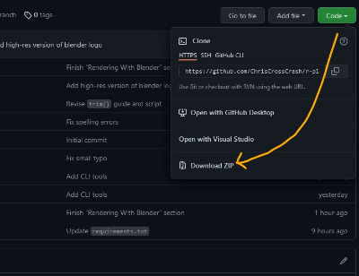

# r/Place Python and Blender Data Visualization

Python scripts and instructions for:

1. [Trimming and formatting the r/Place 2022 dataset](guides/1_trim_and_format.ipynb)
2. [Generating color and heat maps for use in Blender](guides/2_generate_maps.ipynb)
3. [Rendering r/Place in 3D with Blender](guides/3_blender.md)


The scripts can be run with Jupyter Notebook guides, or by using the provided command line tool.

## Prerequisites

- Python >=3.10 (tested on 3.10.2)
- Blender >=3.1 (tested on 3.1.2)
- ~4 GB of free RAM (for processing the data)
- ~15 GB of free space on the hard drive (until the raw data is trimmed)
- It helps to have a powerful GPU for rendering the frames in Blender.

Some basic knowledge of Python and Blender is assumed. It also helps if you know the Pandas and NumPy (the Python libraries). If you are a beginner, here are some Tutorials I highly recommend:

- [Corey Schafer Python Tutorial Playlist](https://youtube.com/playlist?list=PL-osiE80TeTskrapNbzXhwoFUiLCjGgY7)
- [Blender Guru Donut Tutorial Playlist](https://youtube.com/playlist?list=PLjEaoINr3zgFX8ZsChQVQsuDSjEqdWMAD)

## Setup

1. Install [Python](https://www.python.org/) and [Blender](https://www.blender.org/download/) if you haven't already.
2. Clone this repository (or download it as a Zip file and extract).
   
3. Download the [r/Place 2022 dataset](https://www.reddit.com/r/place/comments/txvk2d/rplace_datasets_april_fools_2022/) (named `canvas-history/2022_place_canvas_history.csv.gzip`) as a single file. Do not extract it.
4. Open the repository in a terminal and create a new virtual environment with:
   ```
   python3 -m venv .venv
   ```
5. Activate the virtual environment with:

   Windows:
   ```
   .\.venv\Scripts\activate
   ```
   Linux:
   ```
   source .venv/bin/activate
   ```
6. Install the required packages with:
   ```
   python -m pip install -U pip wheel setuptools
   python -m pip install -r requirements.txt
   ```
   Or, if you have [Poetry](https://python-poetry.org/) installed:
   ```
   poetry install
   ```

## Running the Scripts with Jupyter Notebook

For a tutorial-like experience, you can run the scripts in Jupyter notebook. They allow you read along with the code and see the output.

In the command line, `cd` into the root of this repository. With the virtual environment activated, open the notebook by entering the following command and clicking on one of the listed guides:
```
jupyter notebook guide
```
Follow the guide and execute the code cells to execute each step of the process.

## Running the Scripts with the Command Line

In the command line, `cd` into the root of this repository. With the virtual environment activated, run the following command:
```
python scripts/cli.py --help
```
For help with one of the subcommands, execute:
```
python scripts/cli.py <subcommand> --help
```
### CLI Examples

Process the raw data and save it in `2022_place_canvas_history.parquet`:
```
python scripts/cli.py trim data/2022_place_canvas_history.csv.gzip data/2022_place_canvas_history.parquet
```
Starting at the 72-hour mark, generate 1000 frames at 30 FPS at 1000x speed. Store the results in `data/frames_color` and `data/frames_heat`:

```
python scripts/cli.py generate data/2022_place_canvas_history.parquet data/frames_color data/frames_heat --start_ms 259200000 --timescale 1000 --frames 1000 --fps 30
```

## Development

### Generating a new `requirements.txt` file

Use the following command to generate a new `requirements.txt` file for non-Poetry users:
```
poetry export --without-hashes > requirements.txt
```

## Other Fun Stuff

- [the r/Place Atlas (2022)](https://place-atlas.stefanocoding.me/): A searchable map of the r/Place canvas descriptions of all the different artworks.
- [PlaceViewer](https://github.com/GregBahm/PlaceViewer): r/Place in VR.
