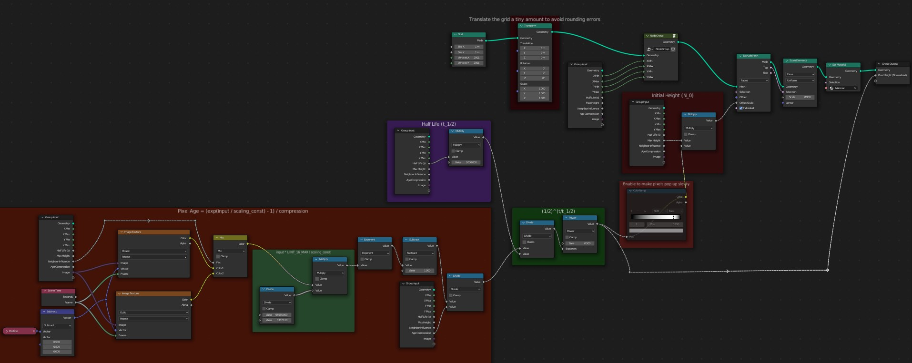
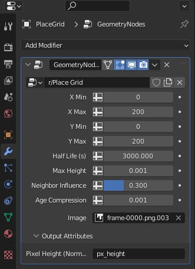

# Rendering With Blender

The final step is to load the color and age maps into Blender, and render the frames we want.

There's nothing really special about the `r-place.blend` file. It doesn't require and addons, and you don't need to run any scripts within Blender. All it has is a camera, light, plane, and a grid generated by Geometry nodes. All we need to do is load the color and age maps into the scene.

## Loading the Color and Age Maps

If you saved your color and age maps in `data/frames_color` and `data/frames_age`, they should already be rendered in the scene. If not, you just need to load the image sequences in the geometry nodes modifier settings and the shader nodes.

## Geometry Node Modifier Settings

The geometry nodes setup is quite simple. First, the log transformation on the color maps is reversed (orange section). The heights of the pixels decay exponentially over time. The length of time for a pixel to lose half its height is determined by the "Half Life (s)" setting (purple and green boxes). This height value then drives the height of the pixels on the grid with an "Extrude Mesh" node. Finally, the color of the grid is set with a "Set Material" node.

- "X Min", "X Max", "Y Min", "Y Max": Most computers will struggle to render the full grid. For better performance, we can render only the parts of the grid that are visible in the final render. These settings let you fine-tune the rendered area.
- Half Life (s): The length of time for a pixel to lose half its height (real-time; not depending on the rendered timescale).
- Max Height: The height of a pixel (in meters) with an age of zero.
- Neighbor Influence: By controlling the [interpolation](https://docs.blender.org/manual/en/dev/modeling/geometry_nodes/texture/image.html) of the pixels, we can control the amount of influence of neighboring pixels on the grid. This lets us give more emphasis to places where several pixels are changing at the same time.
- Age Compression: The amount of compression applied while generating the age maps. Don't change this unless you have also changed it while rendering the age maps.
- Image: The age map image sequence.
- Pixel Height (Normalized): An output attribute that you can use in the shader nodes to get the age of the pixels.

## Conclusion

This project has inspired me to learn more about data science and data visualization. I'm really excited to see what other people can do with it. Please share your artwork with me and the whole Blender community!

If you noticed mistakes or you just want some help with this project, please create an issue here in the [GitHub repository](https://github.com/ChrisCrossCrash/r-place-blender/issues). I'll do my best to help you.

Thanks for checking out my work!
